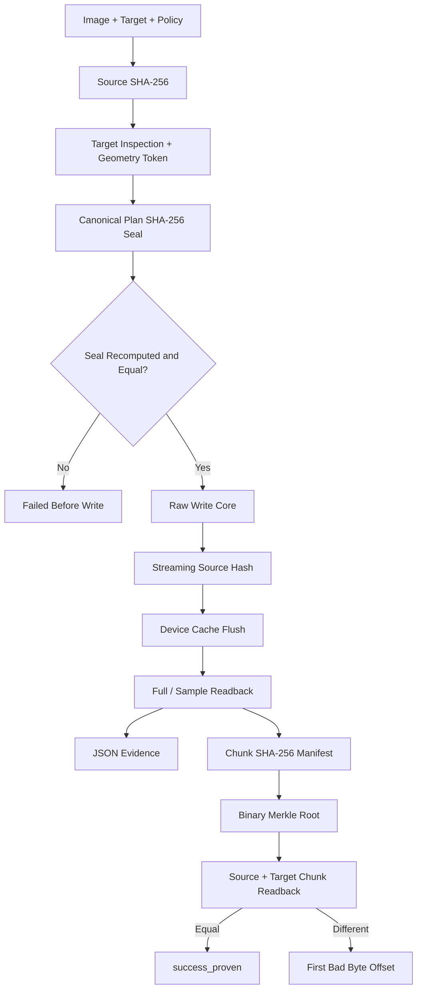

DEADFLASH
=========

WRITE THE IMAGE. VERIFY THE TRUTH.

DEADFLASH is a native, evidence-first USB imaging and formatting utility.
It is built around explicit destructive plans, raw byte I/O, readback proof,
and reproducible measurements.

VERSION
-------

    1.0.0 CANDIDATE

STATUS
------

    CORE IMPLEMENTATION UNDER REVIEW

    - Raw IMG/ISO byte-for-byte writing
    - SHA-256 source hashing
    - Streaming hash of the exact bytes submitted to the writer
    - Full or deterministic sampled readback verification
    - Versioned JSON evidence reports
    - Physical-device confirmation tokens
    - Mounted-target and system-disk guards
    - Native MBR + FAT32 formatter
    - Deterministic benchmark command
    - Cryptographic operation-plan seals
    - Per-chunk SHA-256 proof manifests
    - Binary Merkle root over all chunk hashes
    - Exact first-mismatching-byte localization
    - GCC, Clang, MSVC, ASan, and UBSan CI definitions
    - Physical-device qualification still required

DEADFLASH does not claim full Rufus feature parity. Version 1.0.0 is the
candidate destructive-storage core. It does not yet perform Windows ISO file
extraction, WIM splitting, persistence partitions, Windows To Go, or firmware
boot emulation.

COMPETITIVE EDGE
----------------

DEADFLASH is designed to beat Rufus on one narrow and measurable axis:
auditable write authorization and post-write proof.

That statement is not a claim that DEADFLASH is the better all-purpose boot
media tool. It means the following implemented properties can be measured and
fault-tested directly:

    1. PLAN SEAL

       `deadflash-proof seal` hashes a canonical operation plan containing the
       source SHA-256, source size, target confirmation token, target geometry,
       verification mode, sample count, buffer size, retry policy, direct-I/O
       mode, and regular-file truncation policy.

       `deadflash-proof write --seal HEX` recomputes the complete plan before
       entering the destructive core. Any changed source, target, or policy
       rejects the old seal.

    2. CHUNK PROOF

       `deadflash-proof manifest` records the SHA-256 of every source chunk,
       the full source SHA-256, and a binary Merkle root. The root is an
       integrity summary, not a signature or authenticity certificate.

    3. EXACT DAMAGE LOCATION

       `deadflash-proof verify` validates the manifest, verifies source
       identity, compares every source/target chunk, and reports the first
       mismatching byte offset. A plain whole-image hash can say that data is
       wrong; this path also says where the first wrong byte is.

    4. NO FALSE VERIFIED SUCCESS

       Plan-seal mismatch, source mutation, short write, flush failure,
       readback mismatch, and proof mismatch all produce distinct failure
       states. None may become `success_verified` or `success_proven`.

    5. REPRODUCIBLE COST

       The benchmark contract measures write, flush, verification, proof
       creation, proof verification, mismatch localization, CPU, and memory
       separately. Stronger correctness modes are never compared against a
       weaker mode under one generic throughput number.

These are implementation facts and test targets. Overall superiority over
Rufus remains invalid until raw benchmark files and sacrificial-device fault
results are published.

BUILD
-----

Linux:

    cmake -S . -B build -G Ninja
    cmake --build build
    ctest --test-dir build --output-on-failure

Windows, Developer Command Prompt:

    cmake -S . -B build
    cmake --build build --config Release
    ctest --test-dir build -C Release --output-on-failure

The installed executables are:

    deadflash
    deadflash-proof

FIRST SAFE RUN
--------------

Always inspect a physical device before writing it:

    deadflash list
    deadflash inspect /dev/sdX

Windows:

    deadflash list
    deadflash inspect \\.\PhysicalDrive3

The inspection token is a stale-target guard. It is not a cryptographic
hardware certificate.

STANDARD VERIFIED WRITE
-----------------------

    deadflash write image.iso /dev/sdX \
        --allow-device \
        --confirm 0123456789abcdef \
        --verify full \
        --report run.json

ATTESTED WRITE + PROOF
----------------------

Generate a seal for the exact image, target, and policy:

    deadflash-proof seal image.iso /dev/sdX \
        --verify full \
        --buffer 32MiB

Execute only that sealed plan and emit a chunk proof:

    deadflash-proof write image.iso /dev/sdX \
        --seal 64_HEX_CHARACTER_PLAN_SEAL \
        --allow-device \
        --confirm 0123456789abcdef \
        --verify full \
        --proof image.dfp \
        --chunk 4MiB

Recheck the proof later:

    deadflash-proof verify image.dfp image.iso /dev/sdX

A harmless file-backed workflow:

    deadflash-proof seal image.iso target.img --verify full
    deadflash-proof write image.iso target.img \
        --seal 64_HEX_CHARACTER_PLAN_SEAL \
        --verify full \
        --proof image.dfp

FAT32 FORMAT
------------

    deadflash format-fat32 usb.img --size 512MiB --label DEADBYTE
    deadflash verify-fat32 usb.img

BENCHMARK
---------

    deadflash bench target.bin --size 512MiB --runs 5

A Rufus comparison must use the same image, device, USB port, verification
policy, flush boundary, conditioning, temperature window, and randomized run
order. See `docs/BENCHMARK_PROTOCOL.md`.

ARCHITECTURE
------------

This is implemented control flow, not a future-feature diagram. The Merkle
root detects manifest corruption when checked against a trusted recorded root;
it does not provide authenticity without an external signature.

SAFETY CONTRACT
---------------

    1. A physical target requires --allow-device.
    2. A physical target requires the exact current target token.
    3. An attested write also requires the exact current plan seal.
    4. The target is reinspected before the write handle is opened.
    5. The running system disk is rejected by default.
    6. Mounted targets are rejected on POSIX systems.
    7. Windows volumes are locked and dismounted before raw writes.
    8. Source mutation during the write loop is detected.
    9. Verified success requires post-flush readback.
   10. Proven success requires manifest, source, and target agreement.
   11. Partial-media failure is explicit.
   12. There is no generic SUCCESS state.

RESULT STATES
-------------

    success_verified
    success_unverified
    success_proven
    failed_before_write
    failed_partial_media
    plan_breach_partial_media
    verification_failed
    source_changed
    target_mismatch

SOURCE TREE
-----------

    include/deadflash/   Public core interfaces
    src/common.c         Errors, timing, parsing, aligned allocation
    src/sha256.c         Dependency-free SHA-256
    src/device.c         Device discovery, safety gates, raw OS I/O
    src/pipeline.c       Hash, write, flush, and verification pipeline
    src/attest.c         Canonical operation-plan seals
    src/proof.c          Chunk manifest, Merkle root, mismatch location
    src/fat32.c          Native MBR/FAT32 creation and validation
    src/report.c         JSON evidence writer
    src/main.c           Standard CLI and benchmark frontend
    src/proof_main.c     Attested-write and proof frontend
    tests/               Hash, pipeline, identity, proof, and fault tests
    docs/                Architecture, safety, and benchmark contracts

RELEASE GATE
------------

The `v1.0.0` tag must not be created until all of these are true:

    - GCC build and all tests pass.
    - Clang build and all tests pass.
    - MSVC build and all tests pass.
    - ASan and UBSan tests pass.
    - Plan-seal mutation tests pass.
    - Proof corruption and exact-offset tests pass.
    - File-backed evidence JSON parses successfully.
    - Sacrificial USB write, flush, readback, unplug, power-cycle, and
      corruption tests pass.
    - Raw benchmark files are committed without cherry-picking wins.

LICENSE
-------

GNU GPL version 2 only. The repository's LICENSE file is authoritative.

NO MAGIC. NO GUESSING. WRITE THE BYTES AND READ THEM BACK.
