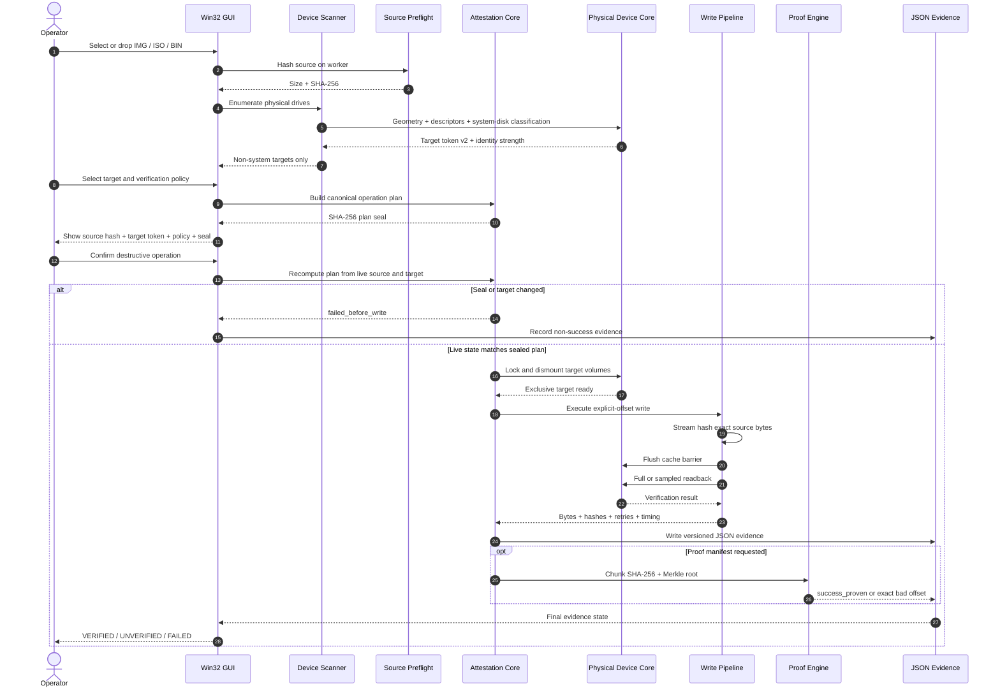
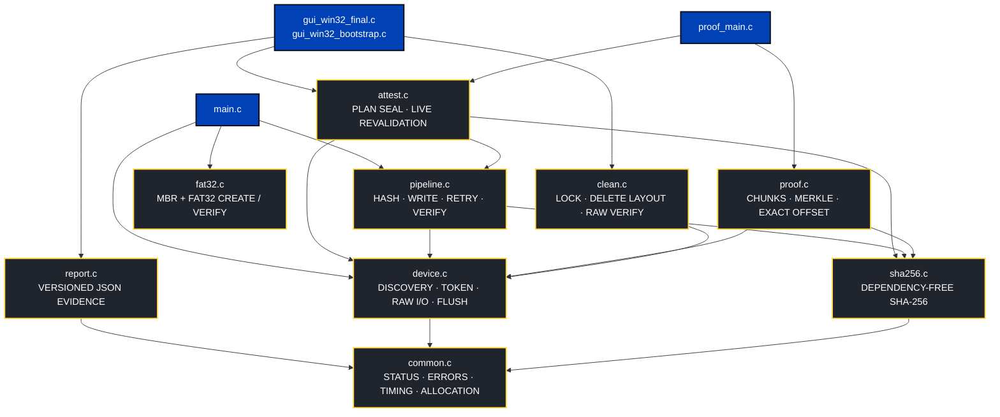

<p align="center">
  
</p>

<p align="center">
  <strong>WRITE THE IMAGE. VERIFY THE TRUTH.</strong>
</p>

<p align="center">
  
  
  
  
  
  
  
  
</p>

DEADFLASH
=========

DEADFLASH is a native, evidence-first USB image writer, verifier, proof engine,
and removable-disk clean utility. It is built around explicit destructive plans,
raw byte I/O, target identity, cache-flush boundaries, readback verification,
and machine-readable evidence.

No browser runtime. No Electron. No hidden write policy. No generic SUCCESS.

REAL WINDOWS OPERATOR VIEW
--------------------------

<p align="center">
  
</p>

The image above is an actual MSVC-built `deadflash-gui.exe` operator session,
not a mockup. It shows the branded USB-flash application icon, source-image
preflight surface, physical-target safety overview, verification policy,
operation log, integrated CLEAN DISK control, and evidence access.

VERSION AND RETAINED CHECKPOINT
-------------------------------

    VERSION                  1.0.0
    QUALIFIED IMPLEMENTATION 7aaaa57097be388a12ebdc1f9da247da706ee10a
    RETAINED EVIDENCE        e4941e16c4ff4a02ccde5f95d6e5b0c59629dc6e
    RELEASE STATUS           UNTAGGED IMPLEMENTATION CHECKPOINT

Implemented surface:

    - Raw IMG / ISO / BIN byte-for-byte writing
    - SHA-256 source preflight and streaming write hash
    - FULL, deterministic SAMPLED, or NONE readback policy
    - Explicit cache-flush boundary before verification
    - Hardware-bound target token v2 and identity strength
    - System-disk, mounted-target, read-only, and capacity guards
    - Canonical operation plan and SHA-256 plan seal
    - Post-confirmation live plan and target revalidation
    - Versioned JSON evidence reports
    - Per-chunk SHA-256 proof manifests
    - Binary Merkle root and exact first-bad-byte localization
    - Native MBR + FAT32 formatter and structural verifier
    - Integrated removable-USB whole-disk clean engine
    - Clean identity revalidation, lock+dismount, layout deletion
    - Clean verification requiring RAW + zero partitions + zero mounts
    - Native C17 + Win32 GUI with real worker-thread progress
    - Dedicated DEADFLASH USB-flash EXE / title-bar / taskbar icon

SYSTEM ARCHITECTURE
-------------------

The frontends collect intent. The core owns destructive policy. A GUI button or
CLI command cannot bypass target classification, authorization, live identity
reinspection, write verification, clean verification, or evidence state.

```mermaid
%%{init: {
  "flowchart": {"curve": "basis", "htmlLabels": true},
  "theme": "base",
  "themeVariables": {
    "fontFamily": "Consolas, Lucida Console, monospace",
    "primaryTextColor": "#E8E8D0",
    "lineColor": "#6B7280",
    "clusterBkg": "#111827",
    "clusterBorder": "#4B5563"
  }
}}%%
flowchart LR
    subgraph SURFACE["OPERATOR SURFACES"]
        GUI["NATIVE WIN32 GUI<br/>SCAN · PREFLIGHT · PLAN · WRITE · CLEAN"]
        CLI["deadflash CLI<br/>LIST · INSPECT · WRITE · FORMAT"]
        PCLI["deadflash-proof CLI<br/>SEAL · WRITE · MANIFEST · VERIFY"]
    end

    subgraph INPUT["LIVE INPUT AND DISCOVERY"]
        IMAGE["SOURCE IMAGE<br/>SIZE + FULL SHA-256"]
        TARGET["PHYSICAL TARGET<br/>PATH + CAPACITY + SECTORS"]
        DESC["DEVICE DESCRIPTOR<br/>BUS + VENDOR + PRODUCT + REVISION"]
        SERIAL["PRIVACY BOUND IDENTITY<br/>SERIAL SHA-256 WHEN EXPOSED"]
        POLICY["OPERATION POLICY<br/>VERIFY + BUFFER + RETRY + DIRECT I/O"]
    end

    subgraph SAFETY["AUTHORIZATION AND SAFETY"]
        CLASSIFY{"TARGET ALLOWED?"}
        TOKEN["TARGET TOKEN V2<br/>SERIAL / DESCRIPTOR / GEOMETRY BOUND"]
        PLAN["CANONICAL OPERATION PLAN"]
        SEAL["SHA-256 PLAN SEAL"]
        CONFIRM["DESTRUCTIVE CONFIRMATION<br/>HASH + TOKEN + POLICY + SEAL"]
        RECHECK{"LIVE PLAN AND TOKEN<br/>STILL IDENTICAL?"}
        REJECT["FAILED BEFORE WRITE<br/>NO MEDIA CHANGE"]
    end

    subgraph WRITE["ATTESTED IMAGE WRITE PIPELINE"]
        LOCK["LOCK + DISMOUNT VOLUMES"]
        RAW["EXPLICIT-OFFSET RAW WRITE"]
        STREAM["STREAM SHA-256 OF<br/>EXACT UNPADDED SOURCE BYTES"]
        MATCH{"WRITE STREAM MATCHES<br/>AUTHORIZED SOURCE?"}
        FLUSH["CACHE FLUSH BARRIER"]
        VERIFY{"VERIFY POLICY"}
        FULL["FULL READBACK"]
        SAMPLE["DETERMINISTIC SAMPLES"]
        NONE["UNVERIFIED RESULT"]
    end

    subgraph CLEAN["REMOVABLE USB CLEAN PIPELINE"]
        CLEAN_GATE{"REMOVABLE USB<br/>NON-SYSTEM · WRITABLE?"}
        CLEAN_CONFIRM["TWO DESTRUCTIVE CONFIRMATIONS"]
        DELETE["DELETE MBR / GPT DRIVE LAYOUT"]
        RAW_VERIFY{"RAW + 0 PARTITIONS<br/>+ 0 MOUNTS?"}
    end

    subgraph PROOF["PROOF AND EVIDENCE"]
        JSON["deadflash.evidence.v1<br/>TARGET + POLICY + TIMING + RESULT"]
        CHUNKS["CHUNK SHA-256 MANIFEST"]
        MERKLE["BINARY MERKLE ROOT"]
        REVERIFY["RECONNECT / POWER-CYCLE<br/>PROOF VERIFICATION"]
        PROVEN["success_proven"]
        OFFSET["target_mismatch<br/>EXACT FIRST BAD BYTE"]
        CLEAN_OK["success_clean_verified"]
    end

    GUI --> IMAGE
    CLI --> IMAGE
    PCLI --> IMAGE
    GUI --> TARGET
    CLI --> TARGET
    PCLI --> TARGET

    TARGET --> DESC --> SERIAL --> TOKEN
    TARGET --> CLASSIFY
    POLICY --> PLAN
    IMAGE --> PLAN
    TOKEN --> PLAN --> SEAL --> CONFIRM --> RECHECK
    CLASSIFY -->|BLOCK| REJECT
    RECHECK -->|NO| REJECT
    RECHECK -->|YES| LOCK

    LOCK --> RAW --> STREAM --> MATCH
    MATCH -->|NO| BREACH["plan_breach_partial_media"]
    MATCH -->|YES| FLUSH --> VERIFY
    VERIFY -->|FULL| FULL --> JSON
    VERIFY -->|SAMPLED| SAMPLE --> JSON
    VERIFY -->|NONE| NONE --> JSON

    IMAGE --> CHUNKS --> MERKLE --> REVERIFY
    FULL --> REVERIFY
    REVERIFY -->|MATCH| PROVEN
    REVERIFY -->|DIFFERENT| OFFSET

    GUI --> CLEAN_GATE
    CLEAN_GATE -->|BLOCK| REJECT
    CLEAN_GATE -->|PASS| CLEAN_CONFIRM --> LOCK
    LOCK --> DELETE --> RAW_VERIFY
    RAW_VERIFY -->|YES| CLEAN_OK --> JSON
    RAW_VERIFY -->|NO| CLEAN_FAIL["CLEAN FAILED<br/>RETAIN EVIDENCE"] --> JSON

    classDef surface fill:#0041B5,stroke:#080A0E,color:#FFFFFF,stroke-width:2px;
    classDef input fill:#1F2937,stroke:#60A5FA,color:#F9FAFB,stroke-width:1px;
    classDef safety fill:#FFD437,stroke:#080A0E,color:#080A0E,stroke-width:2px;
    classDef destructive fill:#7F1D1D,stroke:#FCA5A5,color:#FFFFFF,stroke-width:2px;
    classDef evidence fill:#312E81,stroke:#A5B4FC,color:#FFFFFF,stroke-width:2px;
    classDef success fill:#14532D,stroke:#86EFAC,color:#FFFFFF,stroke-width:2px;
    classDef failure fill:#991B1B,stroke:#FECACA,color:#FFFFFF,stroke-width:2px;

    class GUI,CLI,PCLI surface;
    class IMAGE,TARGET,DESC,SERIAL,POLICY input;
    class CLASSIFY,TOKEN,PLAN,SEAL,CONFIRM,RECHECK,CLEAN_GATE,CLEAN_CONFIRM safety;
    class LOCK,RAW,DELETE destructive;
    class JSON,CHUNKS,MERKLE,REVERIFY evidence;
    class PROVEN,CLEAN_OK success;
    class REJECT,BREACH,OFFSET,CLEAN_FAIL failure;
```



ATTESTED WRITE SEQUENCE
-----------------------

The GUI remains responsive because scan, source preflight, plan construction,
write, verification, and clean operations execute on workers. Destructive work
starts only after the sealed plan is confirmed and recomputed from live state.



CORE MODULE MAP
---------------



SAFETY MODEL
------------

Hard invariants:

    - GUI and CLI frontends do not own destructive policy
    - Physical writes require explicit authorization and a live target token
    - Target identity strength is explicit: SERIAL_BOUND, DESCRIPTOR_BOUND,
      or GEOMETRY_ONLY
    - Raw hardware serial text is never emitted; only its SHA-256 is retained
    - Source, target, safety overrides, and I/O policy are bound into the seal
    - Target and plan changes reject the operation before the write handle opens
    - Source mutation cannot become verified or proven success
    - Short read, short write, lock, dismount, flush, and readback failures remain
      distinct non-success states
    - Full verification occurs after the flush boundary
    - CLEAN DISK is restricted to removable USB physical disks
    - CLEAN DISK blocks system, program, internal, and read-only targets
    - Clean success requires RAW + zero partitions + zero mounts
    - There is no generic SUCCESS state

PHYSICAL QUALIFICATION CHECKPOINTS
----------------------------------

Two real removable devices completed write, cache flush, and full readback:

    SanDisk 3.2Gen1
        identity       SERIAL_BOUND
        bytes written  2,685,403,136
        bytes verified 2,685,403,136
        retries        0
        mismatches     0
        source hash    target hash

    General UDisk
        identity       DESCRIPTOR_BOUND
        bytes written  2,685,403,136
        bytes verified 2,685,403,136
        retries        0
        mismatches     0
        source hash    target hash

Retained records:

    bench/results/deadflash-evidence-20260711-155239.json
    bench/results/deadflash-evidence-20260711-164233.json

These checkpoints prove two complete physical write paths. They do not replace
remaining unplug, reconnect, power-cycle, physical-clean, multi-controller, or
equal-class Rufus qualification.

FINAL WINDOWS SOFTWARE QUALIFICATION
------------------------------------

The retained branded Windows run used Visual Studio 18 2026 x64 and Windows SDK
10.0.26100.0. Release warnings-as-errors passed, the clean contract gate passed,
the application-icon extraction gate passed, CTest passed 7/7, and the
proof/corruption E2E reached:

    write_state          success_verified
    proof_state          success_proven
    corruption_state     target_mismatch
    injected_bad_offset  reported_bad_offset

Retained records:

    bench/results/msvc-qualification-20260714T103504Z.json
    bench/results/msvc-e2e-20260714T103504Z.json

BUILD
-----

Linux core and CLI:

```text
cmake -S . -B build -G Ninja
cmake --build build
ctest --test-dir build --output-on-failure
```

Windows, Developer Command Prompt or PowerShell with MSVC available:

```text
cmake -S . -B build
cmake --build build --config Release
ctest --test-dir build -C Release --output-on-failure
```

Windows qualification harness:

```powershell
& .\scripts\qualify-msvc.ps1
```

Executables:

    deadflash.exe
    deadflash-proof.exe
    deadflash-gui.exe

WINDOWS GUI 1.0.0
-----------------

The GUI is native C17 + Win32. It provides:

    - IMG / ISO / BIN selection and drag-and-drop
    - source size and SHA-256 preflight worker
    - PhysicalDrive enumeration with Windows system disks hidden
    - target vendor, product, capacity, bus, geometry, identity, and token
    - source-versus-target capacity gate
    - FULL, SAMPLED, or NONE readback policy
    - fresh operation-plan sealing and destructive confirmation
    - post-confirmation live revalidation before first media write
    - HASH / WRITE / FLUSH / VERIFY phase and byte progress
    - percent, byte counts, MiB/s, and elapsed time
    - integrated CLEAN DISK worker with two confirmations
    - versioned JSON evidence under Documents\DEADFLASH\Evidence
    - explicit VERIFIED, UNVERIFIED, EVIDENCE-FAILED, CLEAN-VERIFIED,
      and FAILED states

The GUI exposes no system-disk override. The core remains authoritative.

FIRST SAFE RUN
--------------

Inspect before writing:

```text
deadflash list
deadflash inspect \\.\PhysicalDrive3
```

A short target token is a stale-target guard, not a certificate. Treat
GEOMETRY_ONLY identity with greater operator caution.

STANDARD VERIFIED WRITE
-----------------------

```text
deadflash write image.iso \\.\PhysicalDrive3 \
    --allow-device \
    --confirm 0123456789abcdef \
    --verify full \
    --report run.json
```

ATTESTED WRITE AND PROOF
------------------------

Create a seal for the exact image, target, safety authorization, and I/O policy:

```text
deadflash-proof seal image.iso \\.\PhysicalDrive3 \
    --allow-device \
    --confirm 0123456789abcdef \
    --verify full \
    --buffer 32MiB
```

Execute the sealed plan and create a chunk proof:

```text
deadflash-proof write image.iso \\.\PhysicalDrive3 \
    --seal 64_HEX_CHARACTER_PLAN_SEAL \
    --allow-device \
    --confirm 0123456789abcdef \
    --verify full \
    --buffer 32MiB \
    --proof image.dfp \
    --chunk 4MiB
```

Recheck after reconnecting or power-cycling:

```text
deadflash-proof verify image.dfp image.iso \\.\PhysicalDrive3
```

A harmless file-backed workflow:

```text
deadflash-proof seal image.iso target.img --verify full
deadflash-proof write image.iso target.img \
    --seal 64_HEX_CHARACTER_PLAN_SEAL \
    --verify full \
    --proof image.dfp
```

CLEAN DISK
----------

CLEAN DISK deletes the removable USB drive layout. It does not run CLEAN ALL
and does not zero-fill the complete device. The engine revalidates identity,
locks and dismounts volumes, deletes MBR/GPT layout metadata, then requires the
result to report RAW with zero partitions and zero mounts.

Physical clean qualification remains pending. Use sacrificial media only.

FAT32 FORMAT
------------

```text
deadflash format-fat32 usb.img --size 512MiB --label DEADBYTE
deadflash verify-fat32 usb.img
```

BENCHMARK
---------

Core write, flush, and verify collector:

```text
./scripts/benchmark-deadflash.sh \
    ./build/deadflash image.iso target.img 5 full
```

Plan seal, proof creation, proof verification, and fault localization:

```text
python3 scripts/benchmark-proof.py \
    ./build/deadflash-proof image.iso target.img \
    --runs 5 \
    --chunk 4MiB \
    --buffer 32MiB \
    --fault-offset 1048593
```

RUFUS COMPARISON SCOPE
----------------------

DEADFLASH targets Rufus on one narrow, measurable axis:

    AUDITABLE WRITE AUTHORIZATION AND POST-WRITE PROOF

That is not a claim of full Rufus feature parity or broad superiority. A valid
comparison requires the same source image and SHA-256, physical device, port,
controller, OS build, conditioning, flush boundary, verification class,
balanced randomized order, at least five successful runs per tool, and every
failed run retained.

DEADFLASH does not implement Windows ISO extraction, WIM splitting,
persistence partitions, Windows To Go, firmware boot emulation, or Rufus's full
boot-media feature surface.

DOCUMENTATION
-------------

    docs/ARCHITECTURE.md
    docs/SAFETY_MODEL.md
    docs/GUI.txt
    docs/PROOF_FORMAT.md
    docs/EVIDENCE_STATES.txt
    docs/BENCHMARK_PROTOCOL.md
    docs/RUFUS_COMPARISON_SCOPE.md
    docs/USB_QUALIFICATION.md
    docs/WINDOWS_MSVC_QUALIFICATION.md

NO MAGIC
--------

No atomic USB transaction is claimed. Once the first sector is written, power
loss or unplug can leave partial media. DEADFLASH records that truth explicitly
instead of renaming it success.
