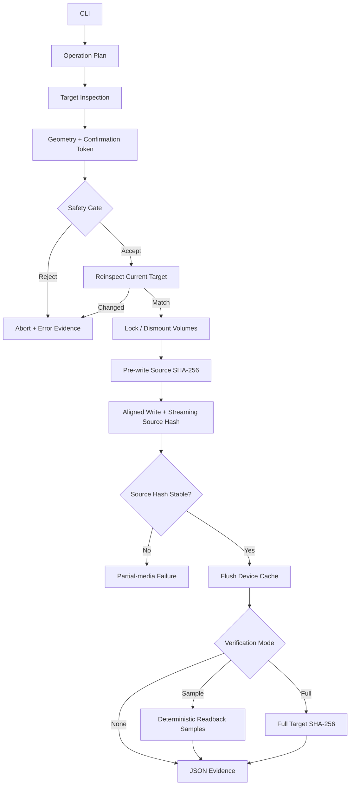

DEADFLASH
=========

WRITE THE IMAGE. VERIFY THE TRUTH.

DEADFLASH is a native, evidence-first USB imaging and formatting utility.
It is intentionally small, explicit, and destructive only after the target
plan has been inspected and confirmed.

VERSION
-------

    1.0.0 CANDIDATE

STATUS
------

    CORE IMPLEMENTATION UNDER REVIEW

    - Raw IMG/ISO byte-for-byte writing
    - SHA-256 source hashing
    - Streaming hash of the exact bytes submitted to the writer
    - Full or deterministic sampled readback verification
    - Machine-readable JSON evidence reports
    - Physical-device confirmation tokens
    - Mounted-target and system-disk guards
    - Native MBR + FAT32 formatter
    - Deterministic benchmark command
    - GCC, Clang, MSVC, ASan, and UBSan CI definitions
    - Physical-device qualification still required

DEADFLASH does not claim full Rufus feature parity. Version 1.0.0 is the
candidate destructive-storage core. It does not yet perform Windows ISO file
extraction, WIM splitting, persistence partitions, Windows To Go, or firmware
boot emulation.

No architecture or feature is described as superior to Rufus without a
reproducible benchmark or a fault-injection result. The differentiators below
are implementation facts about DEADFLASH, not claims about undocumented Rufus
internals.

DIFFERENTIATORS
---------------

    - The target path, type, size, sector geometry, read-only state, and
      system-disk classification are reduced to a confirmation token and
      inspected again immediately before the write handle is opened.
    - The source is pre-hashed, then hashed again as bytes flow through the
      write loop. A mismatch aborts instead of publishing misleading evidence.
    - Result states distinguish verified success, unverified success,
      pre-write failure, partial-media failure, and verification failure.
    - Full verification hashes the exact source-length region after the target
      cache has been flushed and the write handle has been closed.
    - Sample verification uses source-hash-seeded deterministic offsets,
      including the exact first and final source blocks.
    - Every operation can emit a versioned JSON evidence record.
    - The benchmark protocol separates write-only, flush-complete, sampled,
      and full-verification classes instead of mixing correctness levels.

BUILD
-----

Linux:

    cmake -S . -B build -G Ninja
    cmake --build build
    ctest --test-dir build --output-on-failure

Windows, Developer Command Prompt:

    cmake -S . -B build
    cmake --build build --config Release
    ctest --test-dir build -C Release --output-on-failure

The executable is named `deadflash` on POSIX systems and `deadflash.exe` on
Windows.

FIRST SAFE RUN
--------------

Always inspect a physical device before writing it:

    deadflash list
    deadflash inspect /dev/sdX

Windows:

    deadflash list
    deadflash inspect \\.\PhysicalDrive3

The inspection prints a short confirmation token derived from the current
target plan. It is a stale-plan guard, not a cryptographic device certificate.

Write and fully verify an image:

    deadflash write image.iso /dev/sdX \
        --allow-device \
        --confirm 0123456789abcdef \
        --verify full \
        --report run.json

Windows:

    deadflash write image.iso \\.\PhysicalDrive3 ^
        --allow-device ^
        --confirm 0123456789abcdef ^
        --verify full ^
        --report run.json

For a harmless file-backed test:

    deadflash write image.iso target.img --verify full --report run.json

FAT32 FORMAT
------------

Create a 512 MiB file-backed MBR/FAT32 image:

    deadflash format-fat32 usb.img --size 512MiB --label DEADBYTE
    deadflash verify-fat32 usb.img

Format a physical target only after inspection:

    deadflash format-fat32 /dev/sdX \
        --allow-device \
        --confirm 0123456789abcdef \
        --label DEADBYTE \
        --report format.json

BENCHMARK
---------

A quick deterministic file-backed benchmark:

    deadflash bench target.bin --size 512MiB --runs 5

This benchmark measures DEADFLASH only. A Rufus comparison must use the same
image, physical device, USB port, verification policy, flush boundary, device
conditioning, and randomized run order. See `docs/BENCHMARK_PROTOCOL.md`.

ARCHITECTURE
------------

The diagram describes the current code path. It is not a planned-feature or
marketing diagram.

SAFETY CONTRACT
---------------

    1. A physical target requires --allow-device.
    2. A physical target requires the exact current confirmation token.
    3. The target is reinspected immediately before it is opened for writing.
    4. A changed target plan aborts before the first write.
    5. The running system disk is rejected by default.
    6. Mounted targets are rejected on POSIX systems.
    7. Windows volumes are locked and dismounted before raw writes.
    8. Source mutation during the write loop is detected by streaming hash.
    9. A successful write is not called verified unless readback succeeds.
   10. Partial-media failure is reported explicitly.
   11. There is no generic SUCCESS state.

RESULT STATES
-------------

    success_verified
    success_unverified
    failed_before_write
    failed_partial_media
    verification_failed

SOURCE TREE
-----------

    include/deadflash/   Public core interfaces
    src/common.c         Errors, time, parsing, aligned allocation
    src/sha256.c         Dependency-free SHA-256 implementation
    src/device.c         Device discovery, safety gates, raw OS I/O
    src/pipeline.c       Hash, write, flush, and verification pipeline
    src/fat32.c          Native MBR/FAT32 creation and structural validation
    src/report.c         JSON evidence writer
    src/main.c           CLI and benchmark frontend
    tests/               Hash, pipeline, corruption, identity, and FAT32 tests
    docs/                Architecture, safety, and benchmark contracts

RELEASE GATE
------------

The `v1.0.0` tag must not be created until all of these are true:

    - GCC build and tests pass.
    - Clang build and tests pass.
    - MSVC build and tests pass.
    - ASan and UBSan tests pass.
    - File-backed end-to-end evidence JSON parses successfully.
    - Sacrificial USB hardware write, flush, readback, and power-cycle tests pass.

LICENSE
-------

GNU GPL version 2 only. The repository's LICENSE file is authoritative.

NO MAGIC. NO GUESSING. WRITE THE BYTES AND READ THEM BACK.
