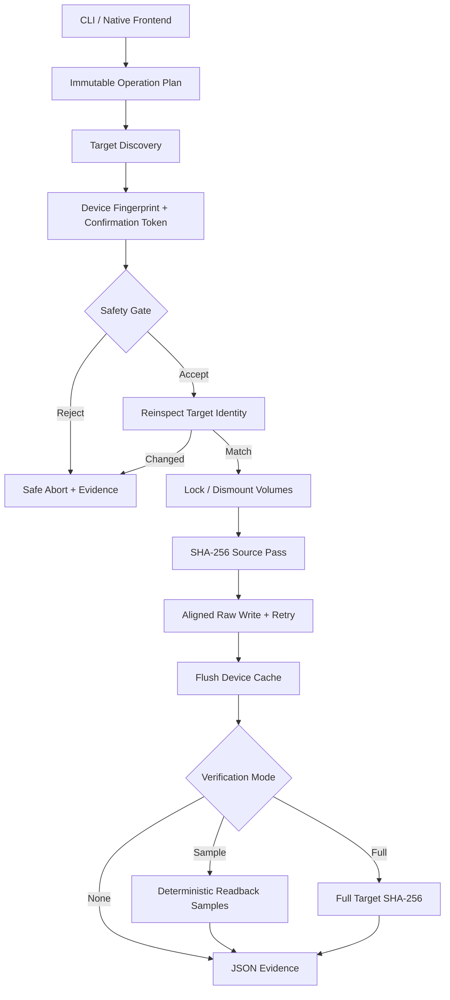

DEADFLASH
=========

WRITE THE IMAGE. VERIFY THE TRUTH.

DEADFLASH is a native, evidence-first USB imaging and formatting utility.
It is intentionally small, explicit, and destructive only after the target
identity has been inspected and confirmed.

VERSION
-------

    1.0.0

STATUS
------

    CORE RELEASE

    - Raw IMG/ISO byte-for-byte writing
    - SHA-256 source hashing
    - Full or deterministic sampled readback verification
    - Machine-readable JSON evidence reports
    - Physical-device confirmation tokens
    - Mounted-target and system-disk guards
    - Native MBR + FAT32 formatter
    - Deterministic benchmark command
    - Linux build and tests verified
    - Windows backend implemented; physical-device validation is still required

DEADFLASH does not claim full Rufus feature parity. Version 1.0.0 is the
verified destructive-storage core. It does not yet perform Windows ISO file
extraction, WIM splitting, persistence partitions, Windows To Go, or firmware
boot emulation.

BUILD
-----

Linux:

    cmake -S . -B build -G Ninja
    cmake --build build
    ctest --test-dir build --output-on-failure

Windows, Developer Command Prompt:

    cmake -S . -B build -G Ninja
    cmake --build build --config Release
    ctest --test-dir build --output-on-failure

The executable is named `deadflash` on POSIX systems and `deadflash.exe` on
Windows.

FIRST SAFE RUN
--------------

Always inspect a physical device before writing it:

    deadflash list
    deadflash inspect /dev/sdX

Windows:

    deadflash list
    deadflash inspect \\.\PhysicalDrive3

The inspection prints a short confirmation token derived from the target path,
size, sector geometry, read-only state, and system-disk classification.

Write and fully verify an image:

    deadflash write image.iso /dev/sdX \
        --allow-device \
        --confirm 0123456789abcdef \
        --verify full \
        --report run.json

Windows:

    deadflash write image.iso \\.\PhysicalDrive3 ^
        --allow-device ^
        --confirm 0123456789abcdef ^
        --verify full ^
        --report run.json

For a harmless file-backed test:

    deadflash write image.iso target.img --verify full --report run.json

FAT32 FORMAT
------------

Create a 512 MiB file-backed MBR/FAT32 image:

    deadflash format-fat32 usb.img --size 512MiB --label DEADBYTE
    deadflash verify-fat32 usb.img

Format a physical target only after inspection:

    deadflash format-fat32 /dev/sdX \
        --allow-device \
        --confirm 0123456789abcdef \
        --label DEADBYTE \
        --report format.json

BENCHMARK
---------

A quick deterministic file-backed benchmark:

    deadflash bench target.bin --size 512MiB --runs 5

This benchmark measures DEADFLASH only. A Rufus comparison must follow the
same image, physical device, USB port, verification policy, flush boundary,
and randomized run order. See `docs/BENCHMARK_PROTOCOL.md`.

ARCHITECTURE
------------

SAFETY CONTRACT
---------------

    1. A physical target requires --allow-device.
    2. A physical target requires the exact current confirmation token.
    3. The target is reinspected immediately before it is opened for writing.
    4. A changed identity aborts before the first write.
    5. The running system disk is rejected by default.
    6. Mounted targets are rejected on POSIX systems.
    7. Windows volumes are locked and dismounted before raw writes.
    8. A successful write is not called verified unless readback succeeds.
    9. Partial-media failure is reported explicitly.
   10. There is no generic SUCCESS state.

RESULT STATES
-------------

    success_verified
    success_unverified
    failed_before_write
    failed_partial_media
    verification_failed

SOURCE TREE
-----------

    include/deadflash/   Public core interfaces
    src/common.c         Errors, time, parsing, aligned allocation
    src/sha256.c         Dependency-free SHA-256 implementation
    src/io.c             Device discovery, safety, raw I/O, verification
    src/fat32.c          Native MBR/FAT32 creation and structural validation
    src/report.c         JSON evidence writer
    src/main.c           CLI and benchmark frontend
    tests/               Hash, pipeline, corruption, and FAT32 tests
    docs/                Architecture, safety, and benchmark contracts

LICENSE
-------

GNU GPL version 2 (ONLY)

NO MAGIC. NO GUESSING. WRITE THE BYTES AND READ THEM BACK.
