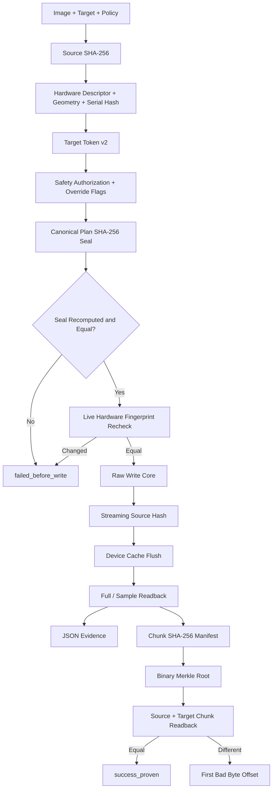

DEADFLASH
=========

WRITE THE IMAGE. VERIFY THE TRUTH.

DEADFLASH is a native, evidence-first USB imaging and formatting utility.
It is built around explicit destructive plans, raw byte I/O, readback proof,
and reproducible measurements.

VERSION
-------

    1.0.0 CANDIDATE

STATUS
------

    CORE IMPLEMENTATION UNDER REVIEW

    - Raw IMG/ISO byte-for-byte writing
    - SHA-256 source hashing
    - Streaming hash of the exact bytes submitted to the writer
    - Full or deterministic sampled readback verification
    - Versioned JSON evidence reports
    - Hardware-bound physical-device confirmation tokens
    - Privacy-preserving serial SHA-256 instead of raw serial disclosure
    - Mounted-target and system-disk guards
    - Native MBR + FAT32 formatter
    - Deterministic benchmark command
    - Cryptographic operation-plan seals
    - Safety override policy bound into every plan seal
    - Per-chunk SHA-256 proof manifests
    - Binary Merkle root over all chunk hashes
    - Exact first-mismatching-byte localization
    - GCC, Clang, MSVC, ASan, and UBSan CI definitions
    - GCC, Clang, GCC ASan, and GCC UBSan validated locally: 7/7
    - MSVC and physical-device qualification still required

DEADFLASH does not claim full Rufus feature parity. Version 1.0.0 is the
candidate destructive-storage core. It does not yet perform Windows ISO file
extraction, WIM splitting, persistence partitions, Windows To Go, or firmware
boot emulation.

COMPETITIVE EDGE
----------------

DEADFLASH is designed to beat Rufus on one narrow and measurable axis:
auditable write authorization and post-write proof.

That statement is not a claim that DEADFLASH is the better all-purpose boot
media tool. It means the following implemented properties can be measured and
fault-tested directly:

    1. HARDWARE-BOUND TARGET TOKEN

       `deadflash inspect` computes target token v2 from the target path, kind,
       capacity, logical and physical sector sizes, read-only/system-disk state,
       bus, vendor, product, revision, and SHA-256 of the hardware serial when
       the device exposes one.

       Raw serial text is never printed or stored. The CLI and JSON evidence
       explicitly report SERIAL_BOUND, DESCRIPTOR_BOUND, or GEOMETRY_ONLY so a
       weak bridge identity is never represented as strong identity.

    2. PLAN SEAL

       `deadflash-proof seal` hashes a canonical operation plan containing the
       source SHA-256, source size, hardware-bound target token, target geometry,
       verification mode, sample count, buffer size, retry policy, direct-I/O
       mode, regular-file truncation policy, physical-device authorization,
       mounted-target override, and system-disk override.

       `deadflash-proof write --seal HEX` recomputes the complete plan before
       entering the destructive core. Any changed source, target fingerprint,
       safety override, or I/O policy rejects the old seal.

    3. CHUNK PROOF

       `deadflash-proof manifest` records the SHA-256 of every source chunk,
       the full source SHA-256, and a binary Merkle root. The root is an
       integrity summary, not a signature or authenticity certificate.

    4. EXACT DAMAGE LOCATION

       `deadflash-proof verify` validates the manifest, verifies source
       identity, compares every source/target chunk, and reports the first
       mismatching byte offset. A plain whole-image hash can say that data is
       wrong; this path also says where the first wrong byte is.

    5. NO FALSE VERIFIED SUCCESS

       Plan-seal mismatch, target-fingerprint change, source mutation, short
       write, flush failure, readback mismatch, and proof mismatch all produce
       distinct failure states. None may become `success_verified` or
       `success_proven`.

    6. REPRODUCIBLE COST

       The benchmark contract measures write, flush, verification, proof
       creation, proof verification, mismatch localization, CPU, and memory
       separately. Stronger correctness modes are never compared against a
       weaker mode under one generic throughput number.

These are implementation facts and test targets. Overall superiority over
Rufus remains invalid until raw physical-device benchmark files and
sacrificial-device fault results are published.

BUILD
-----

Linux:

    cmake -S . -B build -G Ninja
    cmake --build build
    ctest --test-dir build --output-on-failure

Windows, Developer Command Prompt:

    cmake -S . -B build
    cmake --build build --config Release
    ctest --test-dir build -C Release --output-on-failure

The installed executables are:

    deadflash
    deadflash-proof

FIRST SAFE RUN
--------------

Always inspect a physical device before writing it:

    deadflash list
    deadflash inspect /dev/sdX

Windows:

    deadflash list
    deadflash inspect \\.\PhysicalDrive3

Inspection prints the current identity strength, bus/vendor/product/revision,
a SHA-256 of the serial when available, and a short confirmation token. The
short token is a stale-target guard, not a digital certificate. A bridge that
exposes no useful descriptor is reported as GEOMETRY_ONLY and must be treated
with greater operator caution.

STANDARD VERIFIED WRITE
-----------------------

    deadflash write image.iso /dev/sdX \
        --allow-device \
        --confirm 0123456789abcdef \
        --verify full \
        --report run.json

ATTESTED WRITE + PROOF
----------------------

Generate a seal for the exact image, physical target, safety authorization,
and I/O policy:

    deadflash-proof seal image.iso /dev/sdX \
        --allow-device \
        --confirm 0123456789abcdef \
        --verify full \
        --buffer 32MiB

Execute only that sealed plan and emit a chunk proof. The safety flags must be
identical to the flags used during `seal`:

    deadflash-proof write image.iso /dev/sdX \
        --seal 64_HEX_CHARACTER_PLAN_SEAL \
        --allow-device \
        --confirm 0123456789abcdef \
        --verify full \
        --buffer 32MiB \
        --proof image.dfp \
        --chunk 4MiB

Recheck the proof after reconnecting or power-cycling the device:

    deadflash-proof verify image.dfp image.iso /dev/sdX

A harmless file-backed workflow:

    deadflash-proof seal image.iso target.img --verify full
    deadflash-proof write image.iso target.img \
        --seal 64_HEX_CHARACTER_PLAN_SEAL \
        --verify full \
        --proof image.dfp

FAT32 FORMAT
------------

    deadflash format-fat32 usb.img --size 512MiB --label DEADBYTE
    deadflash verify-fat32 usb.img

BENCHMARK
---------

Core write/flush/verify collector:

    ./scripts/benchmark-deadflash.sh \
        ./build/deadflash image.iso target.img 5 full

Plan seal, chunk proof, proof verification, and exact fault localization:

    python3 scripts/benchmark-proof.py \
        ./build/deadflash-proof image.iso target.img \
        --runs 5 \
        --chunk 4MiB \
        --buffer 32MiB \
        --fault-offset 1048593

The committed target-token-v2 file-backed sample is under `bench/results/`.
Its five proof runs all reached `success_proven`. Current medians are 56.819 ms
for plan sealing, 106.908 ms for proof creation, and 159.016 ms for proof
verification on a 6,291,579-byte image. One injected bad byte was reported at
the exact same absolute offset. This is a harness validation result, not a
USB-speed result and not a Rufus comparison.

A Rufus comparison must use the same image, device, USB port, verification
policy, flush boundary, conditioning, temperature window, and randomized run
order. See `docs/BENCHMARK_PROTOCOL.md`.

ARCHITECTURE
------------

This is implemented control flow, not a future-feature diagram. The Merkle
root detects manifest corruption when checked against a trusted recorded root;
it does not provide authenticity without an external signature.

SAFETY CONTRACT
---------------

     1. A physical plan seal requires --allow-device and the live target token.
     2. Target token v2 binds hardware descriptors and a serial hash when the
        operating system and bridge expose them.
     3. Identity strength is explicit; GEOMETRY_ONLY is never called strong.
     4. A physical write requires the same device authorization and token.
     5. Dangerous safety overrides are bound into the plan seal.
     6. An attested write requires the exact current plan seal.
     7. The target fingerprint is recomputed before the write handle is opened.
     8. The running system disk is rejected by default.
     9. Mounted targets are rejected on POSIX systems.
    10. Windows volumes are locked and dismounted before raw writes.
    11. Source mutation during the write loop is detected.
    12. Verified success requires post-flush readback.
    13. Proven success requires manifest, source, and target agreement.
    14. Partial-media failure is explicit.
    15. There is no generic SUCCESS state.

RESULT STATES
-------------

    success_verified
    success_unverified
    success_proven
    failed_before_write
    failed_partial_media
    plan_breach_partial_media
    verification_failed
    source_changed
    target_mismatch

SOURCE TREE
-----------

    include/deadflash/   Public core interfaces
    src/common.c         Errors, timing, parsing, aligned allocation
    src/sha256.c         Dependency-free SHA-256
    src/device.c         Discovery, fingerprinting, safety, raw OS I/O
    src/pipeline.c       Hash, write, flush, and verification pipeline
    src/attest.c         Canonical operation-plan seals
    src/proof.c          Chunk manifest, Merkle root, mismatch location
    src/fat32.c          Native MBR/FAT32 creation and validation
    src/report.c         JSON evidence writer
    src/main.c           Standard CLI and benchmark frontend
    src/proof_main.c     Attested-write and proof frontend
    tests/               Hash, pipeline, identity, fingerprint, proof, faults
    scripts/             CI E2E, hardware qualification, benchmark collectors
    bench/results/       Raw validation and benchmark records
    bench/hardware/      Physical-device evidence records
    docs/                Architecture, safety, proof, and benchmark contracts

RELEASE GATE
------------

The `v1.0.0` tag must not be created until all of these are true:

    - GCC build and all seven tests pass.
    - Clang build and all seven tests pass.
    - MSVC build and all seven tests pass.
    - ASan and UBSan tests pass.
    - Hardware-fingerprint mutation tests pass.
    - Plan-seal and safety-policy mutation tests pass.
    - Proof corruption and exact-offset tests pass.
    - File-backed evidence JSON parses successfully.
    - Sacrificial USB write, flush, readback, unplug, power-cycle, and
      corruption tests pass.
    - Raw benchmark files are committed without cherry-picking wins.

LICENSE
-------

GNU GPL version 2 only. The repository's LICENSE file is authoritative.

NO MAGIC. NO GUESSING. WRITE THE BYTES AND READ THEM BACK.
