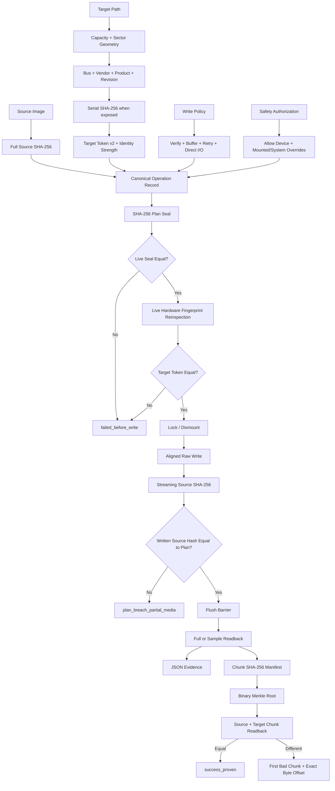
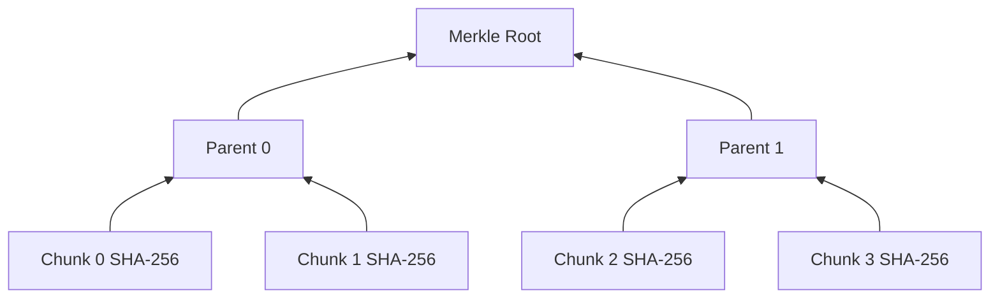

DEADFLASH ARCHITECTURE
======================

VERSION: 1.0.0 CANDIDATE

DESIGN GOAL
-----------

DEADFLASH separates target identity, planning, authorization, execution,
verification, and proof. No frontend owns destructive policy. The raw-device
path lives in the core library and receives an explicit operation configuration.

The competitive target is deliberately narrow:

    BEAT RUFUS IN AUDITABLE WRITE AUTHORIZATION AND POST-WRITE PROOF.

This is not a feature-count claim. Rufus remains substantially broader as a
boot-media creator. DEADFLASH earns the claim above only when the same image,
device, port, flush boundary, and correctness policy are benchmarked and the
raw result files are published.

IMPLEMENTED CONTROL FLOW
------------------------

Every node above exists in the candidate source tree. The diagram is not a
roadmap and does not imply hardware qualification that has not been run.

TARGET TOKEN V2
---------------

`df_compute_target_token` hashes a domain-separated canonical target record:

    deadflash.target.v2
    target path
    target kind
    byte capacity
    logical sector size
    physical sector size
    read-only classification
    system-disk classification
    descriptor-present flag
    serial-bound flag
    bus type
    vendor
    product
    revision
    SHA-256 of hardware serial when exposed

The token shown to the operator remains a short 16-hex stale-target guard. The
full serial is never emitted by the CLI, JSON evidence, or plan seal. Only its
SHA-256 is retained.

Identity strength is explicit:

    SERIAL_BOUND
        Bus/vendor/product/revision and serial SHA-256 are available.

    DESCRIPTOR_BOUND
        Some descriptor fields are available but no serial is exposed.

    GEOMETRY_ONLY
        The operating system or bridge exposes no useful hardware descriptor.

A GEOMETRY_ONLY token is still better than a drive letter because it binds path,
kind, capacity, sector geometry, and safety classification. It is not treated
as unique hardware identity. Physical qualification records must preserve this
strength value.

Windows queries `StorageDeviceProperty` and
`StorageAccessAlignmentProperty`. Linux reads the whole-disk sysfs descriptor
fields and serial when available. Descriptor failure does not invent data; it
falls back to a weaker, explicitly reported identity strength.

OPERATION PLAN ATTESTATION
--------------------------

`df_attest_plan` creates a canonical text record and hashes it with SHA-256.
The record binds all fields that can change the meaning, safety authorization,
or correctness of the write:

    source byte length
    full source SHA-256
    current target token v2
    target kind and byte capacity
    logical and physical sector sizes
    verification mode
    deterministic sample count
    I/O buffer size
    write retry count
    direct-I/O policy
    regular-file truncation policy
    physical-device authorization
    mounted-target override
    system-disk override

A physical plan cannot be sealed unless `--allow-device` and the current target
token are supplied. `deadflash-proof write --seal HEX` recomputes the same
record from live state. Adding or removing a dangerous override changes the
seal and rejects the old authorization before the destructive core is called.

The raw writer also returns the SHA-256 of the exact unpadded source bytes that
flowed through its write loop. The attested wrapper compares that hash with the
hash authorized by the plan. A disagreement can never be reported as success;
it becomes `plan_breach_partial_media` because media may already contain a
partial or unauthorized stream.

Pre-write rejection initializes the result record to `failed_before_write`.
No CLI path prints uninitialized state or byte counters after a bad seal.

The target token and plan seal are hashes, not digital signatures. Anyone who
can replace the trusted binary or seal can create a different valid record.
Their purpose is stale-target and policy-change detection, not operator identity
authentication.

PROOF MANIFEST
--------------

`df_proof_create` splits the source into fixed-size chunks. The default is
4 MiB. For each chunk it stores:

    chunk index
    exact byte length
    SHA-256 digest

It also stores the full source SHA-256 and a binary Merkle root over all chunk
hashes. Parent nodes are domain-separated from leaf hashes by a leading 0x01
byte. An odd final child is duplicated at its level.

The Merkle root is a compact integrity summary. It is not an authenticity proof
unless the root is stored or signed by an external trusted system. DEADFLASH
does not pretend otherwise.

EXACT MISMATCH LOCALIZATION
---------------------------

A whole-image digest reports only that two images differ. The proof verifier
first validates source identity against the manifest, then compares source and
target chunk digests. When a target chunk differs, it byte-compares only that
chunk and reports the first exact bad byte offset.

    target_mismatch
    first_bad_chunk  = N
    first_bad_offset = absolute byte offset
    expected_chunk_sha256
    actual_chunk_sha256

Exact localization requires the original source image. A hash manifest alone
cannot reconstruct the expected byte value, and DEADFLASH does not claim that
it can.

COMPONENTS
----------

COMMON

    Portable status codes, bounded errors, monotonic timing, size parsing,
    constant-time comparisons, and aligned allocation.

SHA256

    Dependency-free SHA-256 used for source identity, write-stream identity,
    target verification, target tokens, plan seals, chunk digests, and Merkle
    parents.

DEVICE

    Target geometry and descriptor discovery, identity-strength classification,
    serial hashing, target token v2, system-disk guard, mount detection, raw
    handles, volume locking, explicit-offset I/O, flush, and live reinspection.

PIPELINE

    Pre-hash, aligned write, retry, streaming source hash, flush, and full or
    deterministic sampled readback.

ATTEST

    Canonical plan creation, physical-device authorization, safety-override
    binding, SHA-256 plan seal, live-state recomputation, seal enforcement,
    deterministic pre-write failure records, and post-write comparison against
    the authorized source hash.

PROOF

    Chunk manifest parser/writer, Merkle construction and validation, source
    identity enforcement, target readback, and exact mismatch localization.

FAT32

    MBR, FAT32 BPB, FSInfo, backup boot data, two FATs, and root volume label.
    Candidate support is limited to 512-byte logical sectors and MBR-sized
    targets up to 2 TiB.

EVIDENCE

    Schema `deadflash.evidence.v1` records target geometry, identity strength,
    descriptor fields, serial SHA-256, token, policy, timings, byte counts,
    verification state, hashes, retries, and errors.

HARD INVARIANTS
---------------

    - A physical plan requires explicit device permission and the live token.
    - Target token v2 changes when a bound descriptor or serial hash changes.
    - Raw serial text is never emitted into evidence or authorization records.
    - Identity strength is explicit and may fall back to GEOMETRY_ONLY.
    - A physical write requires the same permission and token.
    - Mounted-target and system-disk overrides are part of the plan seal.
    - Attested writes bind live source, target fingerprint, safety, and I/O.
    - Source and target I/O use explicit offsets.
    - Short reads and short writes are failures.
    - Target changes abort before the write handle is opened.
    - Source changes cannot produce verified or proven success.
    - Full verification occurs after flush and write-handle close.
    - Proof success requires manifest, source, and target agreement.
    - Manifest structure and Merkle root are validated before target proof.
    - A mismatch reports an exact byte offset when the source is available.
    - Unsupported geometry fails closed.
    - There is no generic SUCCESS state.

MEASURABLE ADVANTAGE CONTRACT
-----------------------------

DEADFLASH may claim an advantage over Rufus only for a metric measured under
equal correctness requirements.

Required proof-oriented metrics:

    plan_seal_ms
    source_hash_ms
    write_ms
    flush_ms
    readback_verify_ms
    proof_create_ms
    proof_verify_ms
    mismatch_localization_ms
    first_bad_offset_accuracy
    peak_working_set_bytes
    cpu_user_ms
    cpu_kernel_ms

A run is disqualified if either tool writes a different image, skips the flush
boundary, uses weaker verification, changes safety policy after authorization,
or reports success after injected corruption.

The repository includes a file-backed token-v2 proof collector and raw sample
records. Those records validate the harness and exact-offset detector. They are
not a physical USB benchmark and not evidence of broad superiority over Rufus.

KNOWN BOUNDARIES
----------------

    - The v1.0 pipeline is synchronous, not an IOCP queue-depth engine.
    - Some USB bridges expose no stable serial or useful descriptor; those are
      explicitly GEOMETRY_ONLY or DESCRIPTOR_BOUND.
    - Token v2 does not yet bind a platform device-instance ID independent of
      the device path.
    - Target tokens and plan seals are hashes, not signatures.
    - Merkle roots provide integrity summaries, not identity authentication.
    - Proof generation stores one 32-byte digest per chunk in memory.
    - Exact byte localization requires the original source image.
    - FAT32 formatting supports 512-byte logical sectors only.
    - GPT, exFAT, NTFS creation, ISO extraction, WIM splitting, persistence,
      Windows To Go, and boot emulation are outside this candidate.
    - Windows descriptor queries and raw-device behavior still require MSVC and
      sacrificial-hardware qualification.

NO MAGIC
--------

No atomic USB transaction is claimed. Once the first sector is written, power
loss or unplug can leave partial media. DEADFLASH records that truth explicitly
instead of renaming it success.
