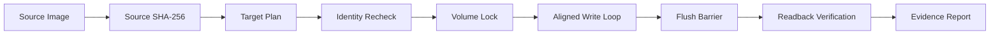

DEADFLASH ARCHITECTURE
======================

VERSION: 1.0.0

DESIGN GOAL
-----------

DEADFLASH separates planning, authorization, execution, and verification.
No UI component owns a raw device handle. The destructive path lives in the
core library and receives an explicit operation configuration.

PIPELINE
--------

COMPONENTS
----------

COMMON

    Owns portable status codes, bounded error strings, monotonic timing,
    size parsing, constant-time byte comparison, and aligned allocation.

SHA256

    A dependency-free SHA-256 implementation. The source image is hashed
    before the first destructive operation. Full verification hashes the
    exact source-length region of the target after flush and handle close.

DEVICE / I/O

    Discovers target geometry and classification. Physical-device writes
    require an explicit allow flag and a target token. The token is checked
    again immediately before opening the target for write access.

    POSIX uses pread/pwrite/fsync. Linux block geometry is queried through
    BLKGETSIZE64, BLKSSZGET, BLKPBSZGET, and BLKROGET.

    Windows uses CreateFile, IOCTL_DISK_GET_LENGTH_INFO, volume disk extents,
    FSCTL_LOCK_VOLUME, FSCTL_DISMOUNT_VOLUME, explicit-offset reads/writes,
    and FlushFileBuffers.

FAT32

    Creates an MBR with one LBA FAT32 partition, a FAT32 BPB, FSInfo sectors,
    backup boot data, two FATs, and a root volume-label entry. It supports
    512-byte logical sectors and MBR-sized targets up to 2 TiB.

EVIDENCE

    Reports use schema `deadflash.evidence.v1`. Reports preserve target
    geometry, safety classification, configuration, timings, byte counts,
    verification state, hashes, retry counts, and errors.

INVARIANTS
----------

    - Source reads never depend on a shared mutable file position.
    - Target writes use explicit offsets.
    - Short reads and short writes are failures.
    - A physical target is never silently inferred from a drive letter.
    - A verification mismatch can never produce success_verified.
    - Full verification is performed after the target cache is flushed.
    - Unsupported geometry fails closed.

KNOWN BOUNDARIES
----------------

    - The v1.0 pipeline is synchronous, not an IOCP queue-depth engine.
    - FAT32 formatting supports 512-byte sectors only.
    - GPT, exFAT, NTFS creation, ISO extraction, WIM splitting, and boot
      emulation are outside this release.
    - Physical hardware validation must be performed on a sacrificial matrix
      before treating the Windows backend as production-qualified.
