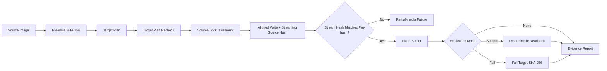

DEADFLASH ARCHITECTURE
======================

VERSION: 1.0.0 CANDIDATE

DESIGN GOAL
-----------

DEADFLASH separates planning, authorization, execution, and verification.
No frontend owns destructive policy. The raw-device path lives in the core
library and receives an explicit operation configuration.

CURRENT PIPELINE
----------------

This diagram describes implemented control flow. It is not a roadmap and does
not imply a performance or reliability advantage over another program.

COMPONENTS
----------

COMMON

    Owns portable status codes, bounded error strings, monotonic timing,
    size parsing, constant-time byte comparison, and aligned allocation.

SHA256

    A dependency-free SHA-256 implementation. The source image is hashed
    before the first destructive operation. The write loop hashes the exact
    unpadded source bytes submitted to the target. A mismatch between the two
    hashes aborts the operation as a changed source.

DEVICE / I/O

    Discovers target geometry and classification. Physical-device writes
    require an explicit allow flag and a target-plan token. The current target
    plan is checked again immediately before opening the target for write
    access.

    The token currently covers path, target kind, size, logical and physical
    sector sizes, read-only state, and system-disk classification. It is not a
    cryptographic device certificate and does not yet include hardware serial,
    VID/PID, or a platform device-instance identifier.

    POSIX uses pread/pwrite/fsync. Linux block geometry is queried through
    BLKGETSIZE64, BLKSSZGET, BLKPBSZGET, and BLKROGET.

    Windows uses CreateFile, IOCTL_DISK_GET_LENGTH_INFO, volume disk extents,
    FSCTL_LOCK_VOLUME, FSCTL_DISMOUNT_VOLUME, explicit-offset reads/writes,
    and FlushFileBuffers.

VERIFY

    Full verification hashes the exact source-length region of the target after
    flush and write-handle close. Sample verification always reads the first
    and exact final source blocks plus deterministic source-hash-seeded blocks.

FAT32

    Creates an MBR with one LBA FAT32 partition, a FAT32 BPB, FSInfo sectors,
    backup boot data, two FATs, and a root volume-label entry. It supports
    512-byte logical sectors and MBR-sized targets up to 2 TiB.

EVIDENCE

    Reports use schema `deadflash.evidence.v1`. Reports preserve target
    geometry, safety classification, configuration, timings, byte counts,
    verification state, hashes, retry counts, and errors.

INVARIANTS
----------

    - Source and target I/O use explicit offsets.
    - Short reads and short writes are failures.
    - Target-plan changes abort before opening the write handle.
    - Source changes during the write stream are detected before success.
    - A physical target is never silently inferred from a drive letter.
    - A verification mismatch can never produce success_verified.
    - Full verification is performed after the target cache is flushed.
    - Unsupported geometry fails closed.

KNOWN BOUNDARIES
----------------

    - The v1.0 pipeline is synchronous, not an IOCP queue-depth engine.
    - The target-plan token does not yet bind to hardware serial/VID/PID.
    - FAT32 formatting supports 512-byte sectors only.
    - GPT, exFAT, NTFS creation, ISO extraction, WIM splitting, and boot
      emulation are outside this release.
    - Physical hardware validation must be performed on a sacrificial matrix
      before treating either raw-device backend as production-qualified.
    - No claim of superiority over Rufus is valid without the published
      benchmark protocol and raw result files.
